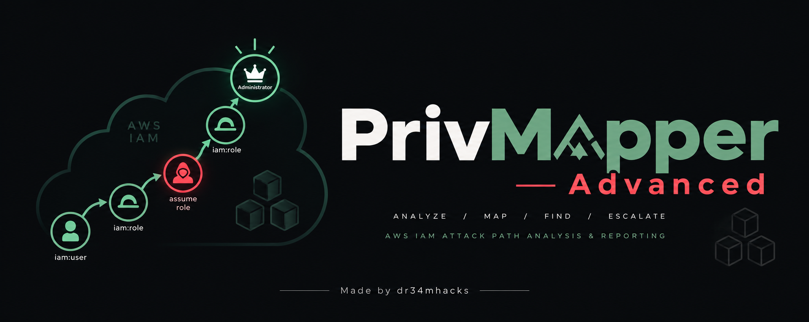
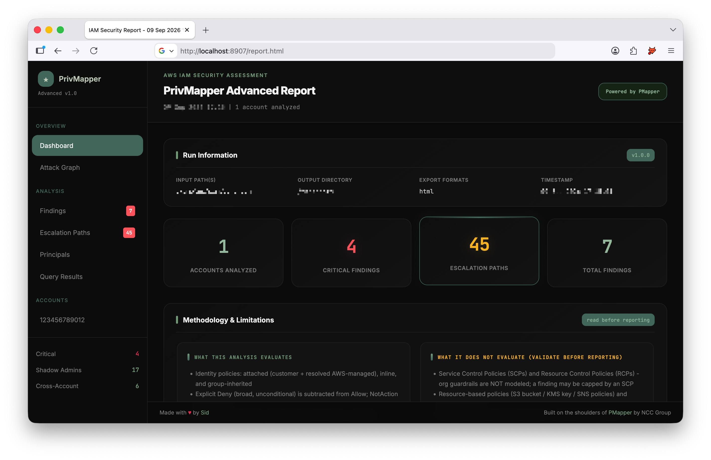
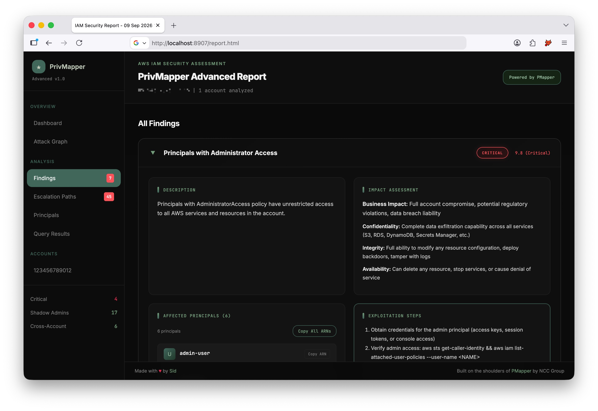
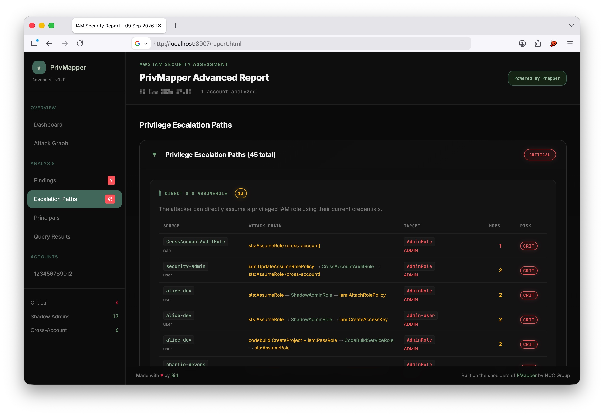
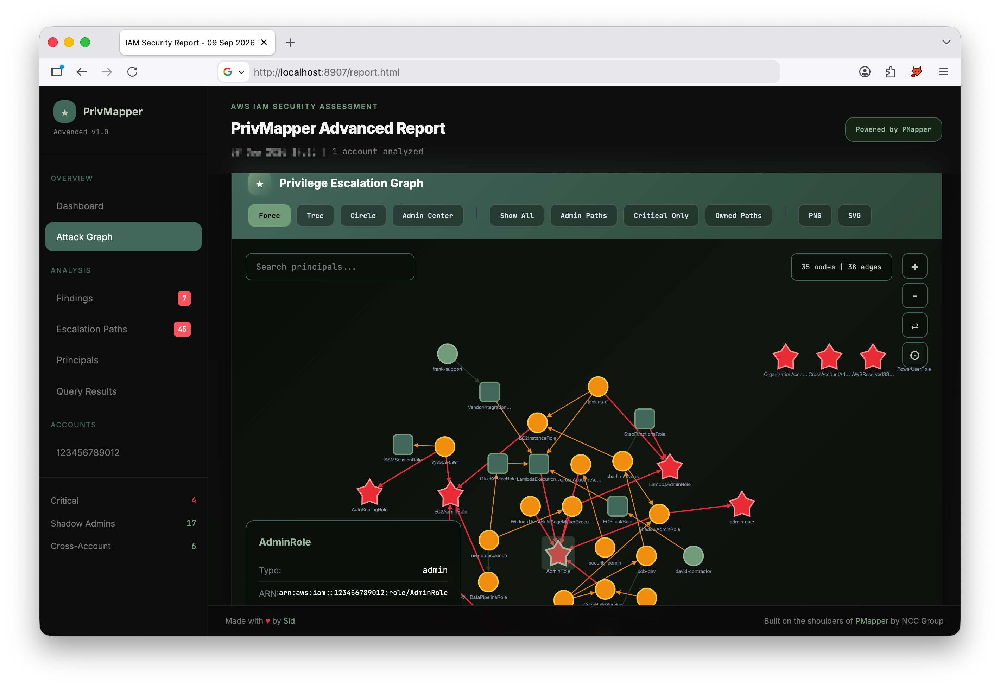

<p align="center">
  
</p>

<p align="center">
  <b>AWS IAM privilege-escalation analysis that comes out as an assessment-ready report.</b><br>
  <sub>Grouped findings · full attack paths · interactive graph · per-finding evidence &amp; MITRE · copy-paste write-ups</sub>
</p>

<p align="center">
  
  
  
  
</p>

<p align="center">
  <a href="#install--run">Install</a> ·
  <a href="#what-you-get">What you get</a> ·
  <a href="#usage">Usage</a> ·
  <a href="#how-it-works">How it works</a> ·
  <a href="#limitations">Limitations</a>
</p>

---

**PrivMapper** turns a [PMapper](https://github.com/nccgroup/PMapper) IAM graph into the report a security team actually ships: grouped findings, full multi-hop escalation chains, an interactive attack graph, and a copy-paste write-up for every finding. It reads a graph offline (no AWS access needed to analyse) or runs PMapper for you across profiles.

Under the hood it models important IAM mechanics present in the graph: explicit `Deny`, `NotAction`, permissions boundaries, inline and group-inherited policies, selected AWS-managed policies, and trust across AWS / federated / service principals. It also surfaces credential hygiene, GitHub-OIDC trust, confused-deputy risk, and boundary-capped access. The documented limitations still require findings to be confirmed against the live account before reporting.

<p align="center">
  
  <br><sub>Dashboard: at-a-glance severity summary, and a methodology panel that states what the analysis does and does not evaluate.</sub>
</p>

## What you get

| Finding | What it shows |
|---|---|
| **Administrator Access** | Full-admin principals, separated from AWS-managed / service admin roles |
| **Shadow Administrators** | Admin-equivalent access with no `AdministratorAccess` attached, plus the exact policy statement that grants it |
| **Overly Permissive** | Broad access ranked by risk, deduplicated against shadow admins |
| **Escalation Paths** | Distinct routes to admin up to five hops, with per-hop policy/resource/condition evidence, relevant target trust, access gained and live-validation checks |
| **Risky Trust** | Cross-account, federated (GitHub OIDC / SAML) and service confused-deputy trust, with enforcement-aware `ExternalId` checks |
| **Credential Hygiene** | Console and privileged users without MFA, and long-term access keys |

Findings carry severity, MITRE ATT&CK mapping, validation guidance, concrete policy/path evidence, and a ready-to-paste report block. The tool does not auto-assign CVSS because a static graph lacks the business and deployment context needed for a defensible score.

<p align="center">
  
  <br><sub>Each finding names the exact policy statement that grants each dangerous action (including via groups), with impact and exploitation steps.</sub>
</p>

<p align="center">
  
  <br><sub>Escalation paths grouped by technique, with the full multi-hop chain, hop count and per-path risk.</sub>
</p>

## Install & run

No third-party dependencies for analysis (Python 3.9+, standard library only).

```bash
git clone https://github.com/dr34mhacks/privmapper
cd privmapper
python privmapper.py --input examples/sample_graph --output ./report
```

This analyses the bundled example graph and serves the report at `http://127.0.0.1:1337` (add `--no-server` to only write files).

PrivMapper ships in **two equivalent forms** whose structured security results are regression-tested for parity:

```bash
python privmapper.py ...                 # single self-contained file, drop-in
PYTHONPATH=src python -m privmapper ...   # modular package (src/privmapper/)
pip install .  &&  privmapper ...         # installed CLI on PATH
pip install ".[pmapper]"                  # + principalmapper, for live --profile collection
```

## Usage

```bash
python privmapper.py --input ~/.local/share/principalmapper/<account>/graph   # your own graph
python privmapper.py --profile prod --profile staging --create-graph          # collect live
python privmapper.py --profiles prod staging audit --workers 3                # direct profile list
python privmapper.py --profile-file ./aws-profiles.txt --workers 4            # newline/comma list
python privmapper.py --profile prod --profile staging --workers 2             # concurrent collection
python privmapper.py --input ./graph --query "who can do iam:PassRole"        # ad-hoc query
python privmapper.py --input ./graph --preset shadow                          # preset query
```

<details>
<summary><b>All options</b></summary>

```
python privmapper.py (--input PATH... | --profile NAME... | --auto-detect) [options]

Input
  -i, --input PATH        PMapper graph directory (repeatable)
  -p, --profile NAME      AWS profile to collect live via PMapper (repeatable)
      --profiles NAME...  One or more profiles to collect concurrently
      --profile-file PATH Newline- or comma-separated profile names (repeatable)
  -a, --auto-detect       Discover graphs in PMapper's platform storage location

Output
  -o, --output DIR        Output directory (default: privmapper_report_<timestamp>)
  -f, --format LIST       html,json,csv (comma-separated) or all (default: html)
      --no-server         Do not start the local viewer after generating
      --port PORT         Viewer port (default: 1337, bound to 127.0.0.1)

Collection (with --profile)
      --create-graph      Auto-detect enabled regions, then run `pmapper graph create`
      --exclude-regions   Regions to skip during graph creation
      --workers N         Maximum profiles to scan concurrently (default: 4)

Queries
  -Q, --query "who can do <action>"
      --preset {privesc,admin,shadow,cross-account,ssm,secrets,s3,dangerous}
```
</details>

## Output

```
report/
├── report.html   # interactive: attack graph, findings, evidence, how-to-report
├── findings.json # structured findings, paths, trusts, credential hygiene
└── findings.csv  # one row per finding-principal and per escalation path
```

The HTML is a self-contained offline report with an embedded, integrity-checked copy of Cytoscape: opening it makes no automatic network requests. It includes the attack graph, collapsible findings, a policy viewer that highlights dangerous permissions, filters, and CSV/JSON export. Each escalation path explains why every hop exists, the exact retained identity-policy and trust evidence, the resulting access, and what must still be validated live. The same structured `hop_explanations`, `resulting_access`, and `validation_notes` are included in JSON; CSV embeds them in its evidence column. External documentation links are optional and open only when clicked, with no referrer header.

<p align="center">
  
  <br><sub>Interactive attack graph: admins (red), shadow admins and roles, with layout, path-highlight and search controls.</sub>
</p>

## How it works

PrivMapper computes each principal's **effective** dangerous permissions, not just what an attached policy says:

- **Allow + Deny.** A broad, unconditional `Deny` (the classic `Deny iam:*` guardrail) is subtracted, so a capped role is not called an admin.
- **`NotAction` / `NotResource`.** `Allow NotAction: iam:*` is treated as the near-admin grant it is; `NotResource` is never silently flipped to `*`.
- **Inline + group policies.** Permissions held only through a group are included in the effective-policy analysis.
- **AWS-managed policies.** `AdministratorAccess`, `PowerUserAccess`, `*FullAccess` and friends are resolved from a built-in catalog; anything unresolved is flagged per-principal so capabilities are never understated silently.
- **Permissions boundaries.** Effective access is intersected with the boundary when its body is available, otherwise the principal is flagged as boundary-capped.
- **Trust policies.** AWS, Federated (SAML and OIDC, incl. GitHub Actions) and Service principals are analysed. `ExternalId` counts only when actually enforced (equality operator, concrete value). Trust into an admin role is escalated; service confused-deputy is flagged only for services that act on other resources, so ordinary execution roles are not false positives.

Escalation paths are scored on complexity, exposure and blast radius, and mapped to MITRE ATT&CK.

## Limitations

Static-graph analysis. The following are **not** modelled, so confirm findings against the live account before reporting (the report repeats these caveats so they travel with the output):

- SCPs / RCPs, so a finding may be capped by an organization guardrail
- Resource-based policies (S3, KMS, SNS, ...) and session policies
- Runtime conditions (source IP, tags, time): noted, not simulated
- Access-key age, last-used, and unused permissions: use an IAM credential report / Access Analyzer
- Escalation-path enumeration is limited to five hops to keep large cyclic graphs tractable

## Verification

The repository includes a PMapper-compatible proof graph with positive and negative controls for `sts:AssumeRole`, `iam:PassRole` plus Lambda execution, partial action wildcards, permission boundaries, group-inherited policies, resource-scoped queries, and converging multi-hop routes.

```bash
python -m unittest discover -s tests -v
```

The suite also verifies concurrent profile collection and checks that the modular package and standalone script emit identical security results.

## Library use

```python
from pathlib import Path
from privmapper import GraphLoader, AnalysisEngine, HTMLExporter

principals, edges, policies = GraphLoader(Path("./graph")).load()
analysis = AnalysisEngine(principals, edges, policies).analyze()

for f in analysis.findings:
    print(f.severity, f.title, len(f.principals))

HTMLExporter.export([analysis], [], Path("report.html"))
```

<details>
<summary><b>Project layout</b></summary>

```
privmapper.py            # single-file build (bundled from the package)
src/privmapper/
├── models.py            # dataclasses (Principal, Policy, Finding, ...)
├── knowledge.py         # dangerous actions, techniques, MITRE and validation guidance
├── managed_policies.py  # AWS-managed policy resolution
├── loader.py            # PMapper graph JSON -> model
├── runner.py            # drive the pmapper CLI (live collection)
├── analysis.py          # the IAM analysis engine
├── queries.py           # "who can do X" query engine
├── remediation.py       # remediation snippets
├── crossaccount.py      # multi-account trust correlation
├── cli.py               # command line / orchestration
└── reporting/           # html / json / csv exporters (+ static CSS/JS assets)
```

`privmapper.py` is the same code bundled into one module for drop-in use; edit the package and re-bundle to keep them in sync.
</details>

## Acknowledgements

Built on [PMapper](https://github.com/nccgroup/PMapper) by NCC Group (which builds the IAM graph), and grew from the original PrivMapper by [Shubham Dubey](https://www.linkedin.com/in/shubham-dubeyy).

## Disclaimer & license

For authorised security assessments only; you are responsible for how you use it. Released under the [MIT License](LICENSE).

<sub>Made by <a href="https://github.com/dr34mhacks">Sid (dr34mhacks)</a></sub>
